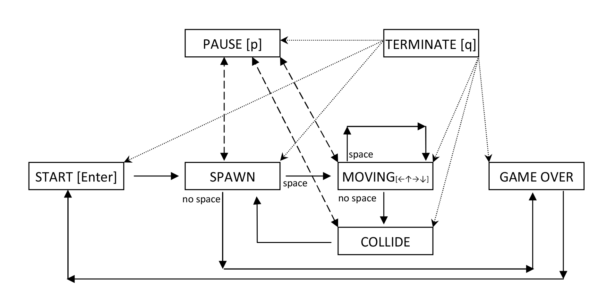

# T_e_t_r_i_s Game (CLI Version)

## Overview

This project is a command-line implementation of the classic T_e_t_r_i_s game. It's built using C and utilizes the ncurses library for terminal-based graphics.
```
src/
├── collision_simulator/         
│   ├── specification.c 
│   ├── specification.h
│   └── t_e_t_r_i_s/
│       ├── game_logic.c
│       └── game_logic.h   
│
├── gui/     
│   ├── input.c  
│   ├── input.h   
│   ├── renderer.c     
│   ├── renderer.h      
│   └── main.c      
│
└── Makefile
```

## Features

*   Classic T_e_t_r_i_s gameplay
*   Terminal-based graphical interface using ncurses
*   Score tracking
*   Basic game controls (left, right, rotate, drop)
*   Clean code structure
*   Makefile for easy building and installation
*   Doxygen-generated documentation

## Dependencies

*   GCC (or another C compiler)
*   ncurses library (libncurses)
*   Check library (libcheck) - for running unit tests
*   Cppcheck - for static analysis

## Building

1.  **Build the project:**

    ```
    make
    ```

    This will compile the source code and create an executable file named `game`.

## Installation

1.  **Install and uninstall the game (optional):**

    ```
    make install
    ```

    This will install the `t_e_t_r_i_s` executable to `/usr/local/bin` (or the directory specified by `PREFIX` and `DESTDIR` in the Makefile). You might need `sudo` for permissions.

    ```
    make DESTDIR=/path/to/installation install
    ```

    This will  install the program to a custom directory.


    ```
    make uninstall
    ```

    This will remove the t_e_t_r_i_s binary from the installation directory.


    If you installed the program to a custom directory, make sure to specify the same DESTDIR:


    ```
    make DESTDIR=/path/to/installation uninstall
    ```
    

## Running the Game

1.  **Run from the project directory:**

    ```
    ./game
    ```

2.  **If installed:**

    ```
    game
    ```

## Controls

*   **Left:** Left arrow key
*   **Right:** Right arrow key
*   **Rotate:** Up arrow key
*   **Down:** Down arrow key (Hard Drop)
*   **Pause:** 'p' key
*   **Quit:** 'q' key


<video width="320" height="240" controls>
  <source src="assets/output.webm" type="video/webm">
  Your browsed does not support video format
</video>


## Finite State Machine (FSM) Schematic

The game logic is driven by a Finite State Machine (FSM). Here's a schematic representation of the FSM:



**State Descriptions:**

*   **SPAWN:** A new Tetromino piece is created and placed at the top of the playing field.
*   **MOVING:** The current piece is actively moving down the playing field. The user can control its horizontal movement and rotation.
*   **COLLIDE:** The current piece has collided with the bottom of the playing field or another piece.
*   **GAMEOVER:** The game is over because the playing field is full and no new pieces can be spawned.
*   **PAUSE:** The game is paused, suspending the game logic.
*   **TERMINATE:** The game is terminated, exiting the program.

**Transitions:**

*   **SPAWN -> MOVING:**  The game transitions to the MOVING state as soon as a new piece is spawned.
*   **MOVING -> COLLIDE:** The game transitions to the COLLIDE state when the current piece collides with the bottom or another piece.
*   **SPAWN -> GAMEOVER:** If there is no space for a new piece to spawn, the game immediately transitions to the GAMEOVER state.
*   **COLLIDE -> SPAWN:**  After a collision, the piece is locked into place, and the game transitions to the SPAWN state to create a new piece.
*   **Any stage -> TERMINATE:** When q is pressed, the game quits.
*   **PAUSE <-> MOVING (or COLLIDE or SPAWN)**: Pressing the 'p' key toggles the PAUSE state.
*   **GAMEOVER -> START**: Pressing Enter starts new game.

## Testing

1.  **Build and run the unit tests:**

    ```
    make test
    ```

    This will compile and run the unit tests, providing feedback on the correctness of the core game logic.

## Code Coverage

1.  **Generate a code coverage report:**

    ```
    make gcov_report
    ```

    This will generate an HTML-based code coverage report in the `coverage_report/` directory. Open `coverage_report/index.html` in your browser to view the report.  Requires `lcov` to be installed.

## Static Analysis

1.  **Run static analysis with Cppcheck:**

    ```
    make cpp
    ```

    This will run Cppcheck to identify potential bugs and coding issues.

## Memory Leak Detection

1.  **Run the game under Valgrind:**

    ```
    make valgrind_game
    ```

    This will run the game under Valgrind, a memory debugging tool, to detect memory leaks and other memory-related errors.

2.  **Run unit tests under Valgrind:**

    ```
    make valgrind_tests
    ```

    This will run the unit tests under Valgrind.

## Code Formatting

1.  **Run clang-format for automatic code formatting:**

    ```
    make cl
    ```

    This will automatically format the C source code according to the project's coding style using `clang-format`.

## Documentation

1.  **Generate DVI Documentation:**

    ```
    make dvi
    ```

    This command will generate DVI documentation using Doxygen and LaTeX. The documentation can then be viewed. Requires Doxygen and LaTeX to be installed.

## Distribution

1.  **Create a distribution archive:**

    ```
    make dist
    ```

    This will create a tarball archive (`game_dist.tar.gz`) containing the source code, README, and Makefile, suitable for distribution.

## Clean Up

1.  **Remove generated files:**

    ```
    make clean
    ```

    This will remove all generated object files, executables, libraries, and the distribution archive.


